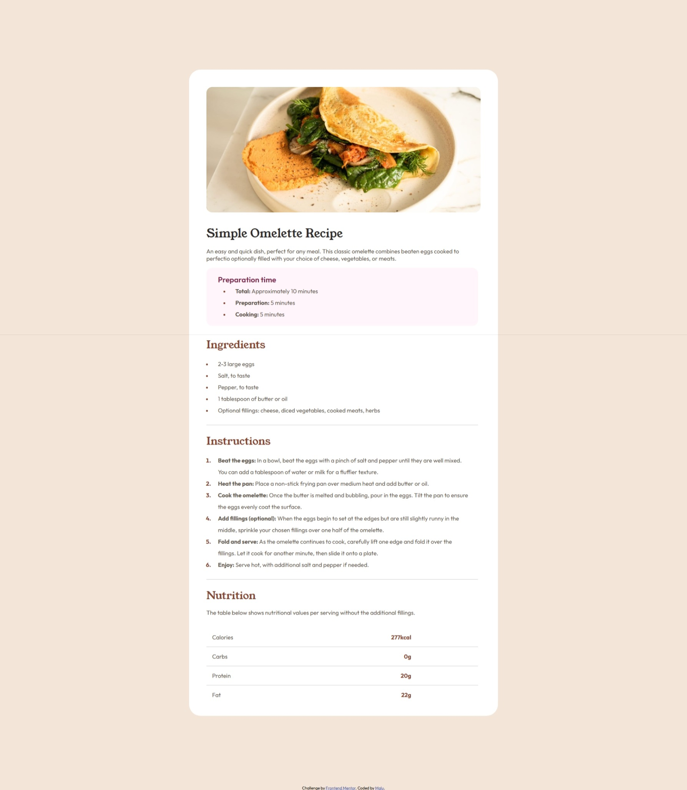

# Frontend Mentor - Recipe page solution

This is a solution to the [Recipe page challenge on Frontend Mentor](https://www.frontendmentor.io/challenges/recipe-page-KiTsR8QQKm). Frontend Mentor challenges help you improve your coding skills by building realistic projects. 

## Table of contents

- [Overview](#overview)
  - [Screenshot](#screenshot)
  - [Links](#links)
- [My process](#my-process)
  - [Built with](#built-with)
  - [What I learned](#what-i-learned)
  - [Continued development](#continued-development)
  - [Useful resources](#useful-resources)
- [Author](#author)

## Overview

### Screenshot




### Links

- Live Site URL: [GitHub Pages](https://maluwhoo.github.io/Frontend-Mentor-Recipe-page/)
- Solution URL: [Frontend Mentor](https://www.frontendmentor.io/solutions/frontend-mentor---recipe-page-solution-iMJ8Z0kT3O)

## My process

### Built with

- Semantic HTML5 markup
- CSS custom properties
- Flexbox
- Mobile-first workflow

### What I learned

This challenge helped me reinforce the importance of semantic HTML. I practiced using elements like main, ul, ol, and <strong> to structure content clearly and meaningfully. I also styled the layout using custom CSS, focusing on visual hierarchy and spacing.

Although I didn’t use elements like section, table, or hr, I found creative ways to achieve the same visual results using styled <div>s. I'm still learning how to make layouts fully responsive, and this project gave me a good opportunity to experiment with media queries and mobile-first design.

```html
<hr class="divisoria">
```
```css
.divisoria {
    border: none;
    height: 1px;
    background-color: #ccc;
    margin: 0.5rem 1rem;
    width: 95%;
}
```

### Continued development

I plan to focus on honing my responsive design skills to ensure my layouts adapt seamlessly to different screen sizes. I also want to deepen my understanding of CSS variables to help me organize styles efficiently and make the project easier to maintain.

### Useful resources

- [HTML elements reference](https://developer.mozilla.org/en-US/docs/Web/HTML/Reference/Elements) - A complete and reliable reference for all HTML elements..
- [CSS Flexbox Layout Guide](https://css-tricks.com/snippets/css/a-guide-to-flexbox/) - A super helpful visual guide to understanding Flexbox.
  
## Author

- GitHub - [MaluWhoo](https://github.com/MaluWhoo)
- Frontend Mentor - [@MaluWhoo](https://www.frontendmentor.io/profile/MaluWhoo)
